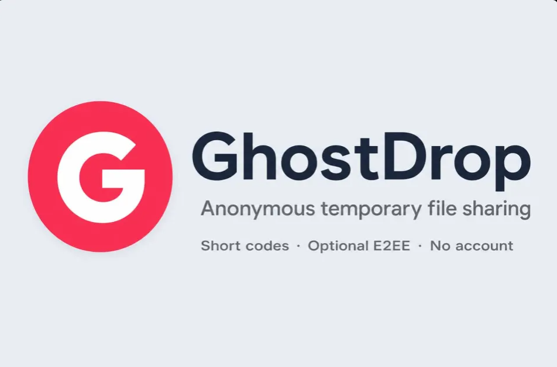
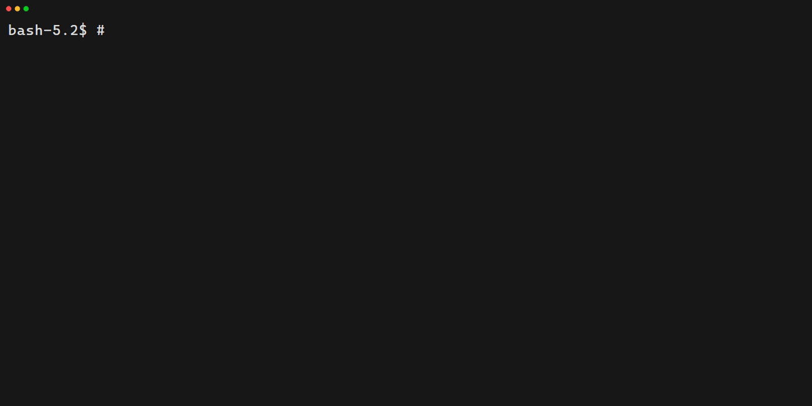
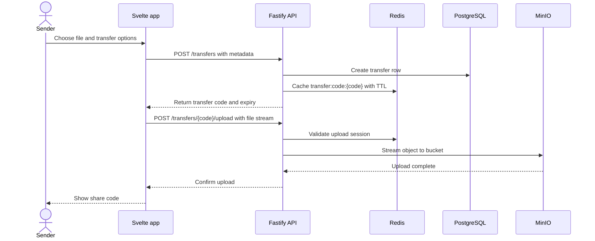
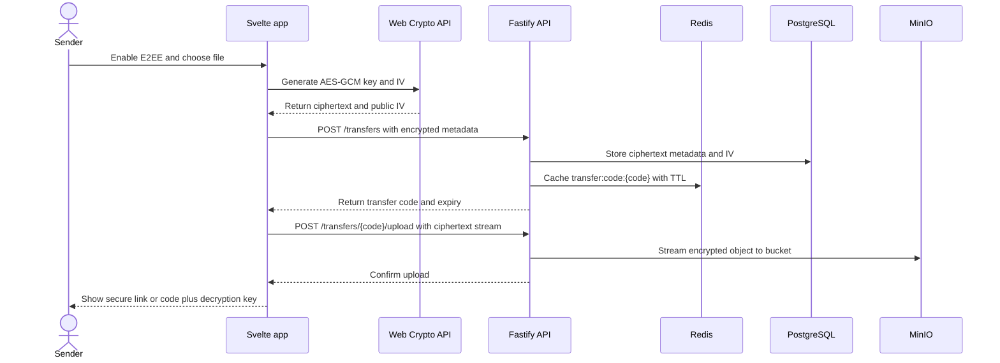
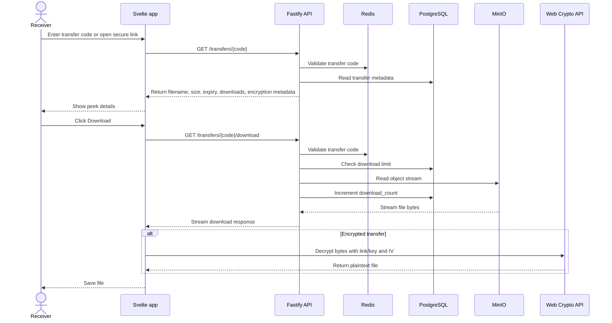
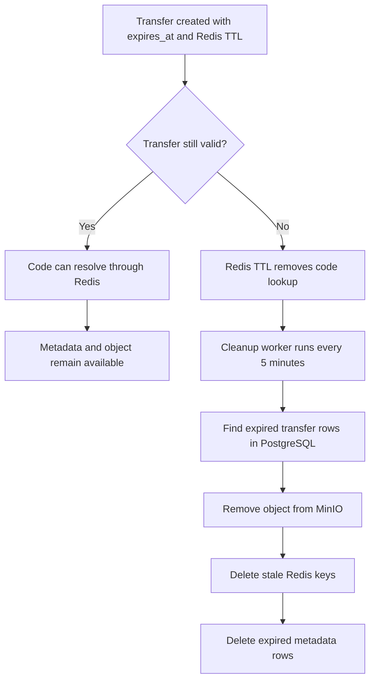
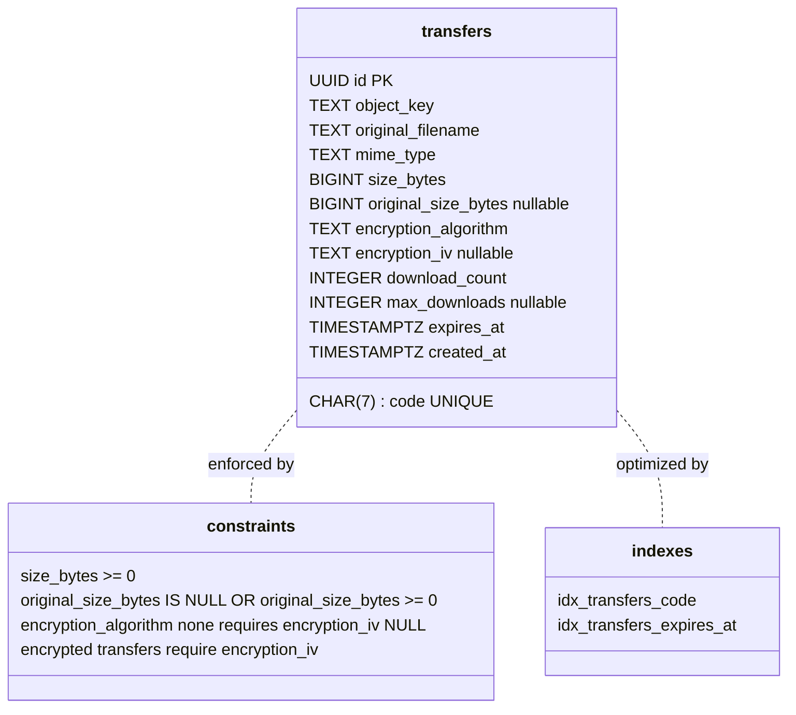

## New 🚀: The GhostDrop CLI: file sharing directly into your terminal,


## Live at: https://ghostdrop.app


## Overview

GhostDrop is an **anonymous**, **temporary file-sharing platform** inspired by Wormhole and SendAnywhere.

Core user flow:

- Upload a file
- Receive a human-friendly transfer code
- Retrieve the file on another device using the code

Core design goals:

- Temporary storage
- Ephemeral transfers
- Streaming uploads/downloads
- Object storage architecture
- Optional client-side end-to-end encryption

## Features

- Anonymous transfer flow: upload a file, get a human-friendly code, and download from another device.
- Optional end-to-end encryption:
- Browser encrypts files with AES-GCM before upload.
- The API stores only ciphertext plus public encryption metadata.
- Encrypted transfers require the secure share link or decryption key to open.
- Code-only transfers remain available when E2EE is disabled.
- Ephemeral transfer sessions with expiration windows (`expires_at`) and cleanup support.
- Download limits per transfer (`max_downloads`) with download counters.
- Streaming-first binary pipeline:
- Upload stream goes directly to MinIO object storage.
- Download stream is served directly from MinIO.
- S3-compatible object storage backend using MinIO.
- Metadata persistence in PostgreSQL (`transfers` table).
- Redis-backed ephemeral state for code/session lookups and rate limiting.
- API hardening with Fastify + Zod validation + multipart limits.
- Unified Caddy gateway:
- Serves frontend static assets.
- Reverse proxies `/api` to Fastify.
- Applies response compression (`zstd`, `gzip`).
- Adds security headers (`X-Frame-Options`, `X-Content-Type-Options`).
- Multi-protocol edge transport via Caddy:
- HTTP/1.1 and HTTP/2 on standard endpoints.
- HTTP/3 support on HTTPS endpoints.
- QUIC transport support via UDP `443` exposure in staging (`443:443/udp`).
- Local/mobile testing support:
- LAN HTTP access mode for devices that fail local TLS validation.
- Localtunnel bypass header flow for mobile tunnel testing.
- Dockerized local staging environment (`compose.staging.yaml`) with auto-migrating backend startup flow.
- TypeScript-first monorepo across frontend and backend.


## Stack

<p align="left">
  <a href="https://github.com/thuongtruong109/icoziv">
    
  </a>
</p>

### Frontend:

[](https://github.com/thuongtruong109/icoziv)

### Backend:

[](https://github.com/thuongtruong109/icoziv)

### Infrastructure:

[](https://github.com/thuongtruong109/icoziv)

## Architecture

### Request path:

- Frontend (Svelte 5)
- Caddy gateway
- Fastify API
- PostgreSQL (metadata)
- Redis (TTL/rate limiting)
- MinIO (binary objects)

## User Flows

### Send a code-only transfer



### Send an encrypted transfer



### Receive, peek, and download



### Expiration and cleanup



## Database

#### Main table:


Encryption metadata notes:

- `size_bytes` is the stored object size. For encrypted transfers, this is the encrypted byte size.
- `original_size_bytes` stores the plaintext size for display when E2EE is enabled.
- `encryption_iv` is public AES-GCM metadata required for browser-side decryption.
- Decryption keys are never stored in PostgreSQL, Redis, MinIO, or API requests.

#### Migrations:

- Manual SQL migrations
- Compiled migration runner (`migrate.js` flow in production)

## Key Architectural Decisions

- Streaming-first pipeline: file data is piped to MinIO to reduce memory pressure.
- Unified gateway: Caddy serves UI and proxies `/api` to Fastify.
- NodeNext compatibility: API imports use `.js` extensions in TS source for ESM runtime compatibility after build.
- Mobile staging support: localtunnel bypass logic + dynamic IP awareness for device testing.
- E2EE is optional: the default code-only flow stays simple, while privacy-sensitive transfers can use a secure link or separate decryption key.
- URL fragments carry E2EE keys in secure links so keys are not sent to the backend by the browser.

## Roadmap


### Completed

- Full anonymous transfer flow with human-friendly codes and streaming pipeline.
- Optional browser-side AES-GCM encryption with URL-fragment key delivery.
- Expiry windows, download limits, automatic cleanup worker.
- Svelte 5 UI with mobile-optimized Peek/Download two-button flow.
- Clipboard paste (Ctrl+V text and images).
- Android PWA with Web Share Target support.
- Dockerized staging and production environments.
- SEO fundamentals (meta tags, robots, open graph, sitemap).
- Atomic download count enforcement (TOCTOU fix), upload completion guard, preview endpoint.
- GhostDrop CLI for terminal-based file sharing (send, receive, E2EE with AES-256-GCM, QR codes, interactive menu).

### Upcoming

| Feature | Description |
|---------|-------------|
| **UI Makeover** | Full redesign with dark mode, drag & drop, multi-file support, upload progress indicators, and a polished landing page. |
| **SEO & Infra** | Structured data, performance optimization, Cloudflare proxy with DDoS protection. |
| **Chunked Encryption** | Stream large files through browser encryption in chunks to reduce memory pressure. |
| **Malware Scanning** | Server-side malware detection API integration before files become downloadable. |
| **Integration Tests** | Automated tests for upload/download pipeline, encrypted transfers, and rate limiting. |
| **CI/CD** | GitHub Actions for lint, type-check, and Docker image builds on every push. |
| **Monitoring** | Prometheus metrics endpoint with health-check alerting. |
| **File Integrity** | SHA-256 checksums in transfer metadata for download verification. |
| **mDNS Discovery** | Local network discovery via `ghostdrop.local` for LAN-only sharing without a server. |

## Local Staging Notes

- Containers expose Caddy on `80/443`.
- For Android local testing, prefer explicit `http://<LAN-IP>` if browser HTTPS upgrade causes cert errors.

## Deployment Operations

- Production server setup, testing, maintenance, backups, and troubleshooting are documented in [`docs/server-ops.md`](docs/server-ops.md).

## Self-Hosting / Local Deployment

GhostDrop is designed to be self-hosted. If the hosted instance at ghostdrop.app ever goes offline, you can run your own instance with Docker in minutes.

### Prerequisites

- [Docker](https://docs.docker.com/get-docker/) and Docker Compose (v2+)
- A domain name pointing to your server (for production)
- Ports 80 and 443 available (for production)

### Quick Start (Local Staging)

For local testing and development:

```bash
git clone https://github.com/your-org/ghostdrop.git
cd ghostdrop
docker compose -f compose.staging.yaml up -d --build
```

Visit `https://localhost` (accept the self-signed certificate warning).

### Production Deployment

1. Clone the repo onto your server:
   ```bash
   git clone https://github.com/your-org/ghostdrop.git
   cd ghostdrop
   ```

2. Copy and configure the environment file:
   ```bash
   cp .env.production.example .env.production
   ```
   Edit `.env.production` with your domain, credentials, and S3 storage details.

3. Create Docker secrets:
   ```bash
   mkdir -p secrets
   echo "your-postgres-password" > secrets/postgres_password.txt
   echo "your-redis-password" > secrets/redis_password.txt
   echo "your-minio-access-key" > secrets/minio_access_key.txt
   echo "your-minio-secret-key" > secrets/minio_secret_key.txt
   ```

4. Start the stack:
   ```bash
   docker compose --env-file .env.production -f compose.prod.yaml up -d --build
   ```

Caddy will automatically provision Let's Encrypt TLS certificates for your domain.

### Requirements

| Component | Minimum | Recommended |
|-----------|---------|-------------|
| CPU | 1 core | 2+ cores |
| RAM | 512 MB | 2 GB |
| Disk | 10 GB | 50 GB+ (depends on expected transfer volume) |
| OS | Any Linux with Docker | Ubuntu 22.04+ |

### Architecture Notes for Self-Hosters

- **Storage:** Files are stored in MinIO (S3-compatible). You can swap it for any S3-compatible service (AWS S3, Cloudflare R2, Backblaze B2) by changing `MINIO_*` environment variables to your provider's endpoint and credentials.
- **Database:** PostgreSQL stores transfer metadata and cleans itself up automatically via the cleanup worker.
- **Ephemeral state:** Redis handles rate limiting and transfer code lookups with automatic TTL expiry.
- **Gateway:** Caddy handles TLS, reverse proxy, and static file serving in a single container.
- **Cleanup:** A background worker runs every 5 minutes to purge expired transfers from storage, database, and Redis.
- **No persistent user data:** GhostDrop is anonymous by design — no accounts, no user tables, no long-term storage. Every transfer expires automatically.

Detailed production operations (firewall, DNS, backups, monitoring) are in [`docs/server-ops.md`](docs/server-ops.md).

## Built with ❤️ and a lot of ☕
