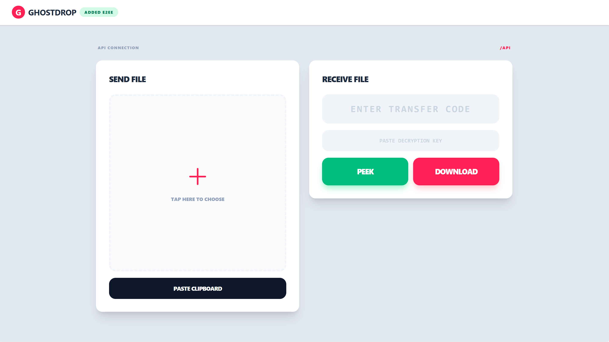
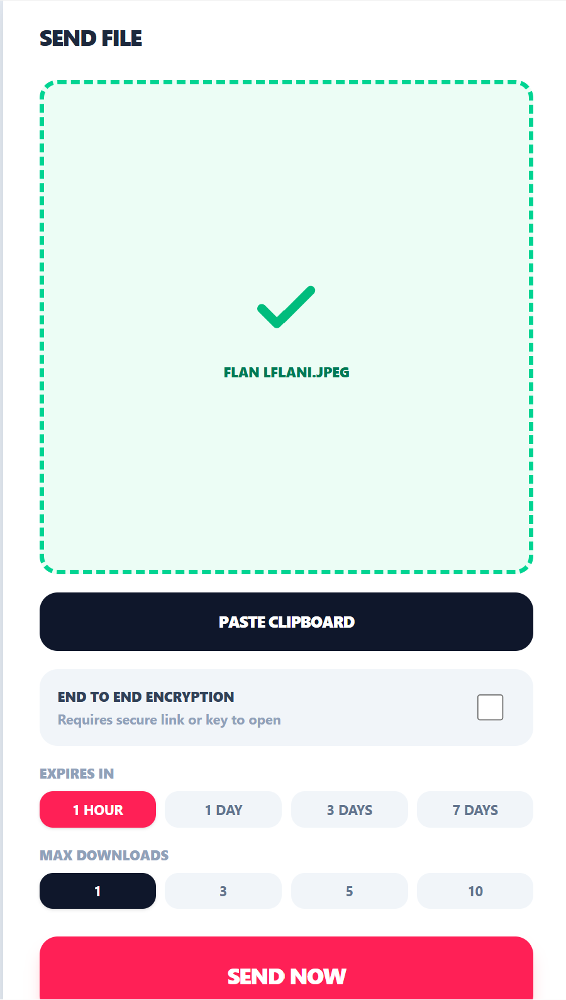

# GhostDrop: Free temporary and anonymous file sharing online
## Live at: https://ghostdrop.app



## Overview

GhostDrop is an **anonymous**, **temporary file-sharing platform** inspired by Wormhole and SendAnywhere.

Core user flow:

- Upload a file
- Receive a human-friendly transfer code
- Retrieve the file on another device using the code

Core design goals:

- Temporary storage
- Ephemeral transfers
- Streaming uploads/downloads
- Object storage architecture
- Optional client-side end-to-end encryption

## Features

- Anonymous transfer flow: upload a file, get a human-friendly code, and download from another device.
- Optional end-to-end encryption:
- Browser encrypts files with AES-GCM before upload.
- The API stores only ciphertext plus public encryption metadata.
- Encrypted transfers require the secure share link or decryption key to open.
- Code-only transfers remain available when E2EE is disabled.
- Ephemeral transfer sessions with expiration windows (`expires_at`) and cleanup support.
- Download limits per transfer (`max_downloads`) with download counters.
- Streaming-first binary pipeline:
- Upload stream goes directly to MinIO object storage.
- Download stream is served directly from MinIO.
- S3-compatible object storage backend using MinIO.
- Metadata persistence in PostgreSQL (`transfers` table).
- Redis-backed ephemeral state for code/session lookups and rate limiting.
- API hardening with Fastify + Zod validation + multipart limits.
- Unified Caddy gateway:
- Serves frontend static assets.
- Reverse proxies `/api` to Fastify.
- Applies response compression (`zstd`, `gzip`).
- Adds security headers (`X-Frame-Options`, `X-Content-Type-Options`).
- Multi-protocol edge transport via Caddy:
- HTTP/1.1 and HTTP/2 on standard endpoints.
- HTTP/3 support on HTTPS endpoints.
- QUIC transport support via UDP `443` exposure in staging (`443:443/udp`).
- Local/mobile testing support:
- LAN HTTP access mode for devices that fail local TLS validation.
- Localtunnel bypass header flow for mobile tunnel testing.
- Dockerized local staging environment (`compose.staging.yaml`) with auto-migrating backend startup flow.
- TypeScript-first monorepo across frontend and backend.

## Optional E2EE flow


## Stack

<p align="left">
  <a href="https://github.com/thuongtruong109/icoziv">
    
  </a>
</p>

### Frontend:

[](https://github.com/thuongtruong109/icoziv)

### Backend:

[](https://github.com/thuongtruong109/icoziv)

### Infrastructure:

[](https://github.com/thuongtruong109/icoziv)

## Architecture

### Request path:

- Frontend (Svelte 5)
- Caddy gateway
- Fastify API
- PostgreSQL (metadata)
- Redis (TTL/rate limiting)
- MinIO (binary objects)

## Database

#### Main table:

- `transfers` (`id`, `code`, `object_key`, `original_filename`, `mime_type`, `size_bytes`, `original_size_bytes`, `encryption_algorithm`, `encryption_iv`, `download_count`, `max_downloads`, `expires_at`, `created_at`)

Encryption metadata notes:

- `size_bytes` is the stored object size. For encrypted transfers, this is the encrypted byte size.
- `original_size_bytes` stores the plaintext size for display when E2EE is enabled.
- `encryption_iv` is public AES-GCM metadata required for browser-side decryption.
- Decryption keys are never stored in PostgreSQL, Redis, MinIO, or API requests.

#### Migrations:

- Manual SQL migrations
- Compiled migration runner (`migrate.js` flow in production)

## Key Architectural Decisions

- Streaming-first pipeline: file data is piped to MinIO to reduce memory pressure.
- Unified gateway: Caddy serves UI and proxies `/api` to Fastify.
- NodeNext compatibility: API imports use `.js` extensions in TS source for ESM runtime compatibility after build.
- Mobile staging support: localtunnel bypass logic + dynamic IP awareness for device testing.
- E2EE is optional: the default code-only flow stays simple, while privacy-sensitive transfers can use a secure link or separate decryption key.
- URL fragments carry E2EE keys in secure links so keys are not sent to the backend by the browser.

## Current Progress

#### Implemented:

- Dockerized local staging environment (`compose.staging.yaml`)
- Svelte 5 UI with mobile-optimized interactions
- Optional AES-GCM E2EE upload/download flow
- Secure share links and copy-to-clipboard controls for encrypted transfers
- Insecure-context awareness in UI
- Localtunnel/mobile testing logic
- Auto-migrating backend container flow

#### Known issue:

- Android local-IP HTTPS can fail due to stricter certificate validation and browser HTTPS-upgrade behavior.

Recent connectivity fix:

- Caddy staging was adjusted so LAN testing on HTTP does not auto-redirect to HTTPS.
- `http://<LAN-IP>` now serves directly for local device testing.

## Next Steps

- Chunked browser encryption for very large files
- Security hardening (replace default credentials with secret management)
- Integration tests for streaming pipeline
- Better local discovery (mDNS like `ghostdrop.local`)
- Complete UI with more features

## Coding Conventions

- TypeScript everywhere
- API imports must use `.js` extensions (ESM / NodeNext)
- Prefer Svelte Runes (`$state`, `$derived`) for frontend reactivity

## Local Staging Notes

- Containers expose Caddy on `80/443`.
- For Android local testing, prefer explicit `http://<LAN-IP>` if browser HTTPS upgrade causes cert errors.

## Deployment Operations

- Production server setup, testing, maintenance, backups, and troubleshooting are documented in [`docs/server-ops.md`](docs/server-ops.md).

## Project Structure
```
ghostdrop
├─ .dockerignore
├─ apps
│  ├─ api
│  │  ├─ Dockerfile
│  │  ├─ package.json
│  │  ├─ src
│  │  │  ├─ config
│  │  │  │  └─ env.ts
│  │  │  ├─ db
│  │  │  │  ├─ migrate.ts
│  │  │  │  └─ migrations
│  │  │  │     ├─ 001_create_transfers.sql
│  │  │  │     └─ 002_add_encryption_metadata_to_transfers.sql
│  │  │  ├─ routes
│  │  │  ├─ server.ts
│  │  │  ├─ services
│  │  │  │  ├─ cleanup.ts
│  │  │  │  ├─ pool.ts
│  │  │  │  ├─ redis.ts
│  │  │  │  ├─ storage.ts
│  │  │  │  └─ transfers.ts
│  │  │  └─ utils
│  │  │     ├─ generate_minio_object_key.ts
│  │  │     └─ generate_session_transfer_code.ts
│  │  └─ tsconfig.json
│  └─ web
│     ├─ eslint.config.js
│     ├─ index.html
│     ├─ package.json
│     ├─ public
│     │  ├─ favicon-16.png
│     │  ├─ favicon-32.png
│     │  ├─ favicon.svg
│     │  └─ icons.svg
│     ├─ README.md
│     ├─ src
│     │  ├─ app.css
│     │  ├─ App.svelte
│     │  ├─ lib
│     │  │  └─ crypto.ts
│     │  └─ main.ts
│     ├─ svelte.config.js
│     ├─ tsconfig.app.json
│     ├─ tsconfig.json
│     ├─ tsconfig.node.json
│     └─ vite.config.ts
├─ Caddy.Dockerfile.production
├─ Caddy.Dockerfile.staging
├─ caddyFile
├─ Caddyfile.production
├─ Caddyfile.staging
├─ compose.prod.yaml
├─ compose.staging.yaml
├─ compose.yaml
├─ docs
│  ├─ server-ops.md
│  └─ test-production-locally.md
├─ package.json
├─ packages
├─ pnpm-lock.yaml
├─ pnpm-workspace.yaml
├─ README.md
├─ screenshot.png
└─ screenshot_2.png
```
## Built with ❤️ and a lot of ☕